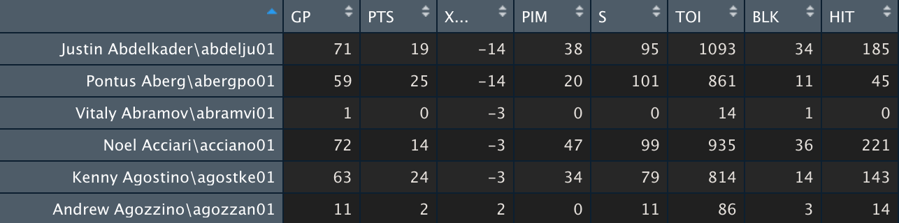

# Stepwise Regression Results

As discussed in `stepwise_regression_research.md`, stepwise regression is a step-by-step process that involves an iterative contstruction of a regression model where independent variables are selected to be used in a final model. With this, stepwise regression essentially determines which independent variables are going to be the most important in a model. It generally shows which indpendent variables have the most impact on the dependent variables. In the case of my forward stepwise regression model, which will be discussed in more detail later in the document, I made the dependent variable total player points (goals + assist) and had a number of other independent variables.

## Background
Briefly, I want to talk about why I used a stepwise regression process to determine some of the most important NHL statistics. While it has it's critics, since it goes thru and determines which statistics are the most important, it will give me a general idea of the statistics that can be used in my model and their potential weights. This is by no means not the "be all, end all" methodology in determining which statistics are the most important, but it does offer useful insights.

## Stepwise Regression Process & Implementation

There are two main types of stepwise regression, as detailed in the `stepwise_regression_research.md` file. These are forward and backward stepwise regression, though both can also be run. With this, in each step of the stepwise regression procedure, a variable is considered to be added (forward) or subtracted (regression) from the rest of the predictor variables. Forward regression involves adding one variable at a time, as the regression model progresses, and is recommended for a larger set of predictor variables. On the other hand, the backward procedure involves deleting one variable at a time as the regression model progresses.

Since there are quite a few statistical variables attributed to NHL players, I decided to implement a forward stepwise regression procedure. Despite my player value/projection tool being implemented in Python, there are not many ways to implement a stepwise regression in it. With this, I turned my attention to the popular data analysis library `R` and found that it offered dedicated tools that would do what I needed.

After acquiring and cleaning NHL data, as detailed later, I implemented my stepwise regression code in `R Studio` after reading a number of different tutorials online (including one from [statology](https://www.statology.org/stepwise-regression-r/)). The implementation can be found in `src/stepwise_regression` and was relatively simple, the main code can be seen below:

```
# Define intercept-only model:
## Use 'PTS' (player points) as the response variable
intercept_only <- lm(PTS ~ 1, data=formatted_nhl_full_stats)

# Define model with all predictors:
## Use 'PTS' (player points) as the response variable
all <- lm(PTS ~ .,data=formatted_nhl_full_stats)

# Perform forward stepwise regression:
forward <- step(intercept_only, direction='forward', scope=formula(all), trace=0)

# View results of forward stepwise regression:
forward$anova

# View the coefficient results of forward stepwise regression:
forward$coefficients
```

First an `intercept_only` linear model is created, where player points (goals + assists) is the response variable (essentially the dependent variable). Data is to be used is set as the cleaned data, which is described in the next subsection. After this, the model is set to use all the predictors.

Now it is time to perform a forward stepwise regression. A stepwise regression procedure object is created as `forward` and is set to use the previously created `intercept_only` model for the procedure. The object is also defined to perform a forward procedure and use the predictor variables defined in `all`. The overall results and coefficient results from performing stepwise regression can then be viewed in the terminal.

### Statistics & Data Used

For the sake of convience in completing a stepwise regression experiment, I decided to download a CSV of NHL data from the 2018-2019 season on [hockey-reference.com](https://www.hockey-reference.com). The original data looked like this:


As you can see, there are a number of things going on. First and foremost, there are multiple instances (rows) of players which is an issue when trying to load the data into R for stepwise regression purposes. There are multiple rows of player data, as some players have been on multiple teams during a given year (and they also have their total stats from these teams calculated, in rows where the team is `TOT`). I had to manually go thru and edit the CSV in Sheets to remove these extra instances, only keeping the cumulative stats.

I then narrowed down what statistical data columns to keep. I removed the useless rank (`rk`) column, the `age` column, the `team` column, and the `position` column. Essentially anything that wasn't an actual statistic was removed. Then, I also removed `Special Team` categorized statistics, `Faceoff` statistics, along with averaged or non-standard statistics that were added by [hockey-reference.com](https://www.hockey-reference.com).

Finally, after manually cleaning this data in Sheets, I exported it to a CSV to be imported into R. After cleaning, the data looked like:


With this, as we can see addition to player names (now the row names), I kept the following numerical variables:
- `GP`: Games played
- `Pts`: Total number of points (goals + assists)
- `+/-`: Appears as `X...`, it is the cumulative positive or negative number which denotes the number of times a player was on the ice for a goal for or a goal against
   - A player is given a minus if they are on the ice for a goal against, impacting their cumulative season-long number.
   - A player is given a plus if they are on the ice for a goal for.
- `PIM`: Penalty minutes
- `S`: Shots on goal
- `TOI`: Cumulative time on ice for the season
- `BLK`: Shot blocks
- `HIT`: Hits by a player

Points (`Pts`) is the response variable as it is the main thing my model will be trying to predict, while the others are the predictor variables. Before running the stepwise regression model, I would infer that shots (`S`) and time on ice (`TOI`) should be some of the most important predictor variables. `+/-`, despite it's many shortcomings that are widely discussed in the hockey community, may have some worth as it shows how many times the player was on the ice for a goal for or goal against (higher `+/-` is better).

## Results

### Overall Results:
```
    Step Df   Deviance Resid. Df Resid. Dev      AIC
1        NA         NA       903  473611.16 5662.227
2    + S -1 391524.641       902   82086.52 4079.865
3  + HIT -1   9652.977       901   72433.54 3968.770
4 + X... -1   4930.774       900   67502.77 3907.037
5  + TOI -1   1468.086       899   66034.68 3889.160
6  + BLK -1  11578.056       898   54456.62 3716.891
7   + GP -1   2329.627       897   52127.00 3679.366
8  + PIM -1    369.638       896   51757.36 3674.933
```

This shows the steps when certain predictor variables were added to the model as apart of the stepwise regression procedure. With this, which step a variable was added has some impact as the variables identified by the model to have the most impact on the response variable (points) are added first.

Player name, which has no impact on the prediction appears first. With this, we can see that shots (`S`) were added first, which is not surprising considering you have to take a shot to score a goal and get a point. Somewhat surprisingly hits were added 2nd, there is a connotation that high-scoring players usually hit less. As discussed earlier, `+/-` was added 3rd as it essentially shows how many times a player was on the ice for a goal. `TOI` or Cumulative Time on Ice for the season was added 5th. `TOI` should be correlated to points as one can assume that when a player is on the ice more, that they should score more. The same can be said with `GP` (games played).

### Coefficient Results:
Here are the coefficient results outputted by the
```
(Intercept)           S         HIT        +/-        TOI         BLK          GP         PIM
-0.12096799  0.18151433 -0.05508178  0.26724104  0.03188499 -0.21303114 -0.17641547  0.04346233
```

With this, the final model generated by the stepwise regression procedure is:
```
Pts ~ (0.18 * S) - (0.05 * HIT) + (0.27 * +/-) + (.032 * TOI) - (0.21 * BLK) - (0.18 * GP) + (0.04 * PIM)
```

We can see that shots (`S`) and plus/minus (`+/-`) are given the most positive weights, likely because, again, you have to shoot to score and `+/-` shows generally how often a player is on the ice for a goal. Another variable given a positive coefficient weight is `TOI` (time on ice) because one can assume that players will score points the more they are on the ice. Surprisingly, `PIM` or penalty minutes are also given a positive weight.

The variables given negative weights were hits, blocked shots, and, surprisngly, games played. Hits and blocked shots were likely weighted correctly as players who play a type of style where they do more of these things typically score less. However, in my opinion, games played should have more of an impact on season-long point totals, though this is a similar metric to `TOI`. That could have partially impacted the coefficient result.

## Major Takeaways

Overall, stepwise regression identified shots, plus/minus, and time on ice to be the most impactful predictor variables in relation to the response variable of points. These predictor variables seem to have merit in helping to predict points.

Outside of this, the procudure did seem to do some weird things, giving some variables like penalty minutes positive weight and variables like games played negative weight. One would assume these weights should be positive in terms of positivity.

Again, stepwise regression is not the be all, end all when desiging models and determining the most important variables. It does however, provide some good insights into the impact some variables could have and a picture of their potential weights in a projection tool.
